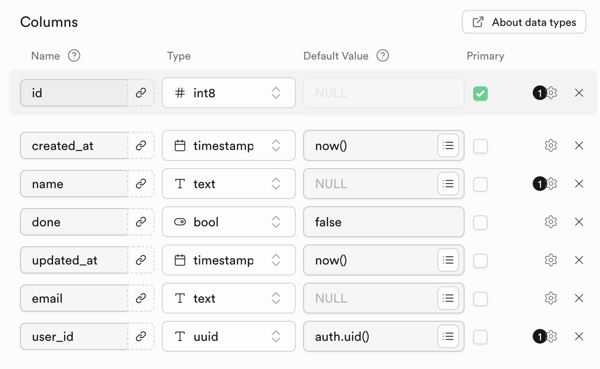

**Build iOS, Android and Vision Pro apps with Supabase and NativeScript**

https://github.com/user-attachments/assets/2537b038-1f1b-45ef-a24e-7134d943294a

iOS, Android and Vision Pro apps flavored with [Angular](https://angular.dev), [Solid](https://solidjs.com) and [Vue](https://vuejs.org) all running [Supabase](https://supabase.com) for realtime data.

- [Setup](#setup)
  - [Add your Supabase URL and Key](#add-your-supabase-url-and-key)
  - [Configure your Supabase for items access](#configure-your-supabase-for-items-access)
- [Choose your preference](#choose-your-preference)
- [What is This?](#what-is-this)
  - [Notes](#notes)

## Setup

Prerequisites:
- [NativeScript Environment Setup](https://docs.nativescript.org/setup)
- node >=20

```
npm run setup
```

### Add your Supabase URL and Key

You will need to configure your own Supabase account to try against the samples.

Create environment files for the following:
- `apps/nativescript-angular/.env`
- `apps/nativescript-solid/.env`
- `apps/nativescript-vue/.env`

With the following:

```
SUPABASE_URL=https://your-account.supabase.co
SUPABASE_ANON_KEY=your-key
```

### Configure your Supabase for items access

1. Create a table named `items`, matching this schema:



2. Make adjustments to the [demo account here](packages/nativescript-data/src/models/supabase.model.ts#16) to use an email/password for a user in your Authenticated > Users section of Supabase.
   
3. Adjust RLS security rules allow create/update/delete on the `items` table

The Todo apps will now come to life. 

## Choose your preference


```
npx nx debug nativescript-angular android
npx nx debug nativescript-angular ios
npx nx debug nativescript-angular visionos
```


```
npx nx debug nativescript-solid android
npx nx debug nativescript-solid ios
npx nx debug nativescript-solid visionos
```


```
npx nx debug nativescript-vue android
npx nx debug nativescript-vue ios
npx nx debug nativescript-vue visionos
```

## What is This?

An [Nx workspace](https://nx.dev) with Angular, Solid and Vue (iOS, Android and Vision Pro) apps all powered by [Supabase](https://supabase.com/).

### Notes

- `packages/nativescript-data/src/services/supabase.ts` isolates the data handling, which is shared among all the apps.
- `App_Resources` are shared between all apps via their `nativescript.config` > `appResourcesPath` setting.

All practices shared are for demonstration purposes only.

